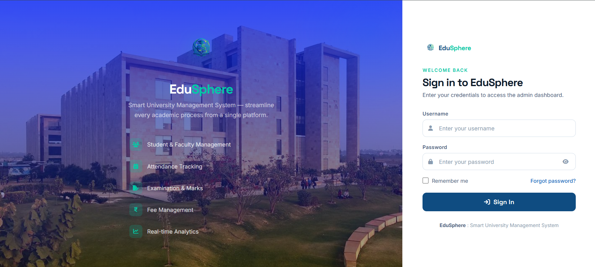

# EduSphere

## Overview

EduSphere is a modern University Management System designed to streamline academic and administrative operations through a centralized digital platform.

The project combines a modern web-based interface built with HTML, CSS, and JavaScript with Java and MySQL backend modules for managing university operations efficiently.

<p align="center">
  
</p>

## Features

### Dashboard

- University analytics and statistics
- Academic performance overview
- Administrative insights
- Quick access to system modules

### Student Management

- Add student records
- Update student information
- Manage academic details
- View student profiles

### Faculty Management

- Add faculty members
- Manage teacher records
- Department allocation
- Faculty profile management

### Attendance Management

- Student attendance tracking
- Faculty attendance tracking
- Attendance reports
- Attendance analytics

### Examination Management

- Marks entry system
- Examination records
- Result generation
- Performance tracking

### Fee Management

- Fee structure management
- Payment records
- Fee tracking
- Financial reporting

## Technology Stack

| Category              | Technology              |
| --------------------- | ----------------------- |
| Frontend              | HTML5, CSS3, JavaScript |
| Backend               | Java                    |
| Database              | MySQL                   |
| Database Connectivity | JDBC                    |
| Icons                 | Font Awesome            |
| IDE                   | VS Code                 |
| Version Control       | Git & GitHub            |

## Project Structure

```text
EduSphere/
│
├── Assets/
├── CSS/
├── JS/
├── Pages/
│
├── Java-Backend/
│   ├── AddStudent.java
│   ├── AddTeacher.java
│   ├── Conn.java
│   ├── EnterMarks.java
│   ├── ExaminationDetails.java
│   ├── FeeStructure.java
│   ├── Login.java
│   ├── Marks.java
│   ├── Project.java
│   ├── StudentAttendance.java
│   ├── StudentDetails.java
│   ├── StudentFeeForm.java
│   ├── TeacherAttendance.java
│   ├── TeacherDetails.java
│   ├── UpdateStudent.java
│   ├── UpdateTeacher.java
│   └── mysql_commands.txt
│
├── index.html
├── README.md
└── .gitignore
```

## Modules

### Authentication Module

Secure administrator login and access control.

### Student Module

Manage student information, profiles, and academic records.

### Faculty Module

Manage teacher records, departments, and faculty information.

### Attendance Module

Track attendance records for students and faculty members.

### Examination Module

Manage examinations, marks, and result generation.

### Fee Module

Track student fee payments and manage fee structures.

## Database

EduSphere uses MySQL as the primary database system.

### Core Tables

- login
- student
- teacher
- attendance_student
- attendance_teacher
- marks
- subject
- fee

## Installation

### Clone Repository

```bash
git clone https://github.com/your-username/EduSphere.git
```

### Configure Database

Create a MySQL database:

```sql
CREATE DATABASE ums;
```

Import SQL commands from:

```text
Java-Backend/mysql_commands.txt
```

### Configure JDBC

Update database credentials inside:

```text
Java-Backend/Conn.java
```

### Run Project

1. Configure MySQL Database
2. Import SQL Tables
3. Run Java Backend Modules
4. Launch Frontend Pages in Browser

## Future Enhancements

- Student Portal
- Faculty Portal
- Online Fee Payment Integration
- Placement Management
- Notification System
- Cloud Deployment
- Mobile Application
- Advanced Analytics Dashboard

## Screenshots

- Login Page
- Dashboard
- Student Management
- Faculty Management
- Attendance Management
- Examination Management
- Fee Management

## Developer

**Mayank Prashar**

Bachelor of Technology (Computer Science & Engineering)

Galgotias University

## Project Vision

EduSphere aims to simplify university administration by integrating academic and administrative processes into a unified digital ecosystem.

## License

This project is developed for educational and learning purposes.
